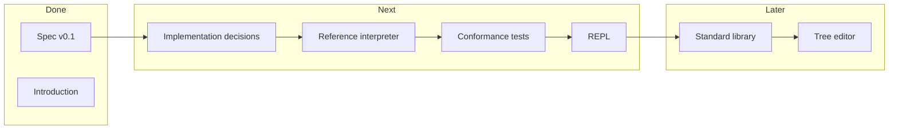
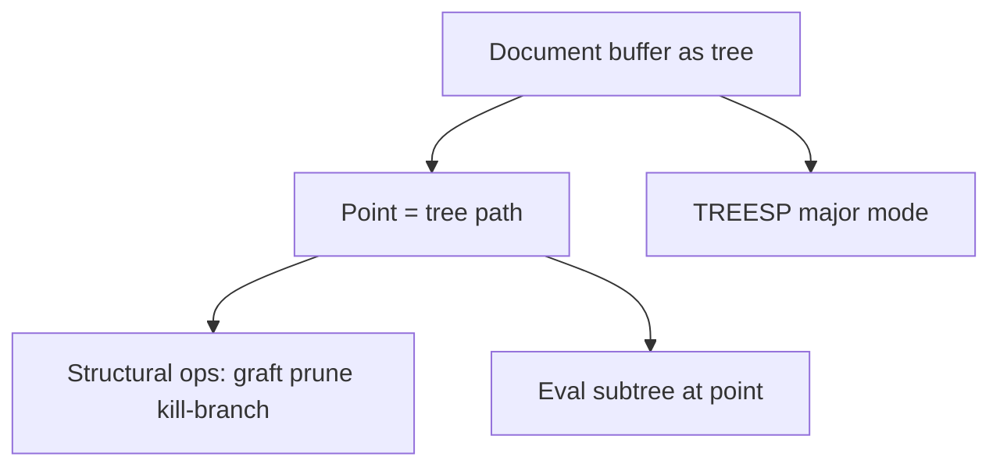

# TREESP Next Steps — Full Phased Roadmap

## Where you are now

| Done | Not started |
|------|-------------|
| [docs/TREESP.md](docs/TREESP.md) — full v0.1 language spec | Reference interpreter |
| [docs/INTRODUCTION.md](docs/INTRODUCTION.md) — origin story + editor challenge | Conformance tests |
| [README.md](README.md) — doc index | REPL / tooling |
| Git history on `main` | Standard library beyond primitives |

The spec explicitly marks this as **"Specification only — no reference implementation in this milestone"** ([TREESP.md §1.2](docs/TREESP.md)). Milestone 0.1 is complete; milestone 0.2 is **make it run**.



---

## Phase 0 — Lock decisions (1 short doc or spec addendum)

Before writing code, resolve the open questions in [§12](docs/TREESP.md) that block an interpreter. You do **not** need to resolve everything — only what the first runnable milestone needs.

| Decision | Spec today | Recommended for v0.2 |
|----------|------------|----------------------|
| **Scoping** | Dynamic scope is normative; lexical "recommended" | **Lexical scope** — matches closures in §5.3 and avoids surprise |
| **Extra `argN` on user calls** | "Recommend: error" | **Error on unexpected branches** — catches bugs early |
| **Macro hygiene** | Open | **Non-hygienic** (caller env expansion per §8.2) — simplest first pass |
| **Rest parameters** | Open | **Defer** — use explicit `arg0`…`argN` until needed |
| **Errors** | Open | **Host errors** (strings + abort) — no exception trees yet |
| **Implementation language** | Open | Pick one host; see below |

**Deliverable:** a short `docs/IMPLEMENTATION.md` (or §12.1 "Resolved for v0.2") recording these choices so the interpreter has a single source of truth.

### Host language options

| Language | Pros | Cons |
|----------|------|------|
| **Dart** | Good fit for a tree ADT, `package:test`, you already have Dart tooling/skills | Less common for language impls |
| **Rust** | Fast, explicit ADTs, good for a long-lived reference impl | More boilerplate for eval loop |
| **Scheme/Racket** | Trees + eval are native; fastest path to a working REPL | Less useful as a "reference" for non-Lispers |

No wrong answer — pick based on who will maintain it. Dart is a reasonable default if you want tests and a CLI quickly.

---

## Phase 1 — Core value model + printer

Build the runtime representation of everything in [§2 Values](docs/TREESP.md):

```
Value = Atom(number|symbol|string|bool) | Tree(tag, orderedBranchMap) | Void
```

Key implementation details from the spec:

- Trees use **labeled branches** (`arg0`, `arg1`, … from reader desugaring)
- Branch maps preserve **insertion order** (§2.2)
- Trees are **immutable**; `graft`/`prune` return copies (§7.3)
- `()` is **void**, distinct from `(tag)` with zero branches (§2.3)

**Deliverables:**
- `lib/value.dart` (or equivalent): `TreespValue`, `TreespTree`, interned symbols
- `lib/printer.dart`: `display` — round-trip S-expressions (may always print desugared `argN` form per §7.8)
- Unit tests: void vs empty tree, `equal?` structural equality

Suggested project layout:

```
treesp/
  pubspec.yaml          # if Dart
  bin/treesp.dart       # future REPL entry
  lib/
    value.dart
    printer.dart
    reader.dart           # Phase 2
    eval.dart             # Phase 3
  test/
    value_test.dart
    reader_test.dart
    eval_test.dart
  examples/             # .treesp files from spec §10
```

---

## Phase 2 — Reader

Implement [§4 Reader](docs/TREESP.md) exactly:

1. S-expression tokenization (numbers, symbols, strings, `#t`/`#f`, comments)
2. Abbreviation expansion (`'`, `` ` ``, `,`, `,@`) per §4.5
3. Positional desugaring → `arg0`, `arg1`, … per §4.2
4. Reader errors per §4.3 (mixed branches, duplicate labels, unclosed `(`)

**Tests to write first** (from Appendix A):

| Input | Expected |
|-------|----------|
| `()` | void |
| `(f a b)` | tree `f` with `arg0→a`, `arg1→b` |
| `(f (x a))` | explicit label, no `arg0` |
| `'x` | `(quote (arg0 x))` |

Quasiquote **abbreviations** expand at read time; full `quasiquote` evaluation comes in Phase 5.

---

## Phase 3 — Minimal evaluator + REPL skeleton

Implement [§5 Evaluation](docs/TREESP.md) with **lexical scope**:

### Special forms (Phase 3a)
`quote`, `if`, `lambda`, `define`, `begin`, `and`, `or` — per [§6](docs/TREESP.md)

### Primitives (Phase 3b)
- Predicates: `atom?`, `tree?`, `void?`, `number?`, `symbol?`, `eq?`, `equal?`
- Arithmetic: `+`, `-`, `*`, `/`, `=`, `<`, comparisons
- I/O: `display`, `newline`

### Environment (Phase 3c)
Environment as tree with `parent` branch per [§5.4](docs/TREESP.md):

```treesp
Env := Tree { tag: env, branches: { sym: Value, ..., parent: Env | void } }
```

**Milestone check:** run spec §10.1 arithmetic and §10.2 factorial from a REPL.

```treesp
(define fact (lambda (n) (if (= n 0) 1 (* n (fact (- n 1))))))
(fact 5)    ; => 120
```

---

## Phase 4 — Tree primitives + traversal

Add [§7.2–7.5](docs/TREESP.md):

- Accessors: `tag`, `branch`, `branches`, `branch-labels`, `branch?`
- Construction: `node`, `graft`, `prune`, `tag-set`
- Navigation: `path`
- Traversal: `fold-tree`, `walk-tree`, `map-branches`, `filter-branches`

**Milestone check:** spec §10.3 (AST navigation) and §10.7 (graft/prune).

---

## Phase 5 — Remaining special forms + macros

### Special forms
`let`, `cond`, `set!`, `match` (§6.9–6.10, §7.6)

### Macros
`define-macro`, expansion per §8.2, built-in `quasiquote` walker per §8.5

**Milestone check:** §10.5 quasiquote example and `when`/`defun` macros from §8.3–8.4.

---

## Phase 6 — Conformance suite

Turn [§10 Examples](docs/TREESP.md) into executable tests:

| Example | What it validates |
|---------|-------------------|
| §10.1 | Arithmetic + desugaring |
| §10.2 | Closures, recursion |
| §10.3 | Tree accessors |
| §10.4 | `fold-tree` |
| §10.5 | Quasiquote |
| §10.6 | `match` |
| §10.7 | `graft`/`prune` |
| §10.8 | Linked-tree sequence idiom |

Add **reader error tests** for every row in §4.3.

Optional: a `treesp test` command that runs all `examples/*.treesp` and compares stdout.

---

## Phase 7 — Polish & publish v0.2

- `read` primitive (read from stdin in REPL loop)
- Error messages that cite source position
- Update [README.md](README.md) with build/run instructions
- Tag release: **v0.2 — reference interpreter**
- Commit message style already established on `main`

---

## Phase 8 — Standard library (v0.3)

Implement planned helpers from [§9.5](docs/TREESP.md):

- `merge-branches`, `rename-branch`, `depth`, `size`, `clone`
- Possibly `error` primitive (referenced in §10.6 example but not formally specified)

Defer module system (`import`/`export`) until there's real pressure.

---

## Phase 9 — The editor (adamo's homework, v1.0+)

Only after the language runs. The [INTRODUCTION.md counter-challenge](docs/INTRODUCTION.md) sketches the architecture:



Concrete sub-milestones:

1. **Tree buffer model** — document is a labeled tree, not a line array; point is `(path buf l1 l2 …)`
2. **Structural editing** — `kill-branch`, `graft` (yank), tree-aware motion
3. **TREESP mode** — highlight by tree shape; branch-aware paren matching
4. **Eval at point** — embed the Phase 3–5 interpreter; `C-x C-e` on subtree
5. **Command language** — minibuffer commands as TREESP trees (stretch goal)

This is a large UI project. It could be a terminal TUI first, or a Flutter app, or — if adamo is feeling historical — an Emacs layer written once TREESP can embed in Emacs.

---

## Suggested immediate next action

If you want to start coding tomorrow, the smallest high-value slice is:

**Phase 0 (1 hour) + Phase 1 (value model + printer) + Phase 2 (reader) + one eval test (`(+ 1 2)` → `3`)**

That gives you a runnable proof-of-concept in a few focused sessions before committing to the full primitive surface area.

---

## What to defer indefinitely

- Static type system
- Compiler / bytecode VM
- Module system
- Numeric tower beyond IEEE doubles
- Full Emacs clone

These are correctly marked non-goals or open questions in v0.1.
