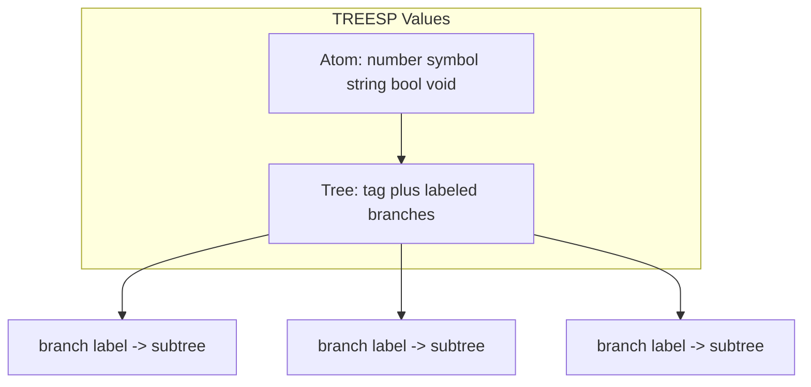
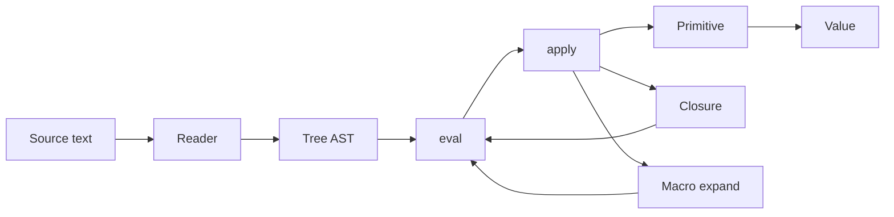

# TREESP Language Specification Plan

## Core idea

TREESP keeps what makes LISP pleasant — S-expression syntax, homoiconicity, `quote`/`eval`, `lambda`, macros — but replaces the **cons cell** with a **labeled-edge tree node**. There is no `cons`, `car`, `cdr`, dotted pairs, or improper lists. A value is either an **atom** or a **tree**.



**Mental model:** In LISP, `(f a b)` is "a list of three elements." In TREESP, `(f a b)` is "a tree tagged `f` with two branches `a` and `b`." Same surface syntax, different semantics and primitives.

---

## Deliverable

A single specification document: [`docs/TREESP.md`](docs/TREESP.md)

Sections: philosophy, data model, syntax, reader, evaluation, special forms, primitives, standard library (conceptual), examples, anti-features (what TREESP rejects).

No interpreter, tests, or toolchain in this milestone.

---

## 1. Data model

### Atoms
| Type | Examples | Notes |
|------|----------|-------|
| number | `42`, `-3.14` | IEEE doubles at spec level |
| symbol | `foo`, `+`, `arg0` | interned identifiers |
| string | `"hello"` | opaque text |
| boolean | `#t`, `#f` | |
| void | `()` or `∅` | absence / empty tree sentinel (pick one canonical form in spec) |

### Trees
A tree is a record:

```
Tree := { tag: Symbol, branches: Map<Symbol, Tree | Atom> }
```

- **tag** — the node's identity (operator name, type tag, user label).
- **branches** — zero or more **labeled** children; order is not semantically significant unless a primitive explicitly iterates in insertion order.
- Duplicate branch labels are a **reader error** (deterministic programs).

Leaves are atoms, or trees with tag `leaf` and a single `val` branch (spec will pick one convention and stick to it — recommend: **atoms are leaves; no wrapper required**).

### Labeled vs positional sugar
Fully explicit form:

```treesp
(+ (arg0 1) (arg1 2))
;; tag=+, branches={ arg0 -> 1, arg1 -> 2 }
```

**Positional sugar** (reader desugaring, not semantic lists): bare subtrees after the tag get implicit labels `arg0`, `arg1`, …

```treesp
(+ 1 2)  ==>  (+ (arg0 1) (arg1 2))
```

This preserves familiar LISP call syntax while keeping labeled edges as the only composite representation.

---

## 2. Syntax (S-expressions)

### Atomic forms
```
<number> | <symbol> | <string> | #t | #f | ()
```

### Compound forms
```
(<tag> <branch>*)
<branch> ::= <subtree>                    ;; positional sugar
           | (<label> <subtree>)          ;; explicit label
```

### Quoting
| Form | Meaning |
|------|---------|
| `'expr` | `(quote expr)` |
| `` `expr `` | `(quasiquote expr)` |
| `,expr` | `(unquote expr)` |
| `,@expr` | `(unquote-splicing expr)` — see splicing rules below |

### Comments
`;` to end of line (Scheme-style).

---

## 3. Reader algorithm (specified precisely)

Document in spec as pseudocode:

1. Read S-expression recursively.
2. If compound and elements after tag are **all** either atoms/compounds **without** leading label symbols in label position → apply **positional desugaring** (`arg0`…`argN`).
3. If any element is `(label subtree)` form → treat as explicit branch; no positional desugaring for that node.
4. Mixed explicit + bare subtrees → **reader error**.
5. `()` reads as **void**, not an empty tree node.

**Quasiquote splicing:** `,@expr` may only appear inside a compound form. Splicing **grafts** branches from a tree value into the surrounding node (not list concatenation). Spec will define: spliced value must be a tree whose branches are merged into the parent; duplicate labels → error.

---

## 4. Evaluation model

Same eval/apply skeleton as Scheme, adapted to trees.

### Eval
```
eval(atom, env)       -> atom
eval(void, env)       -> void
eval((quote t), env)  -> t
eval((if c t f), env) -> ...
eval((lambda ...), env) -> closure
eval((define ...), env) -> binding + void
eval((set! ...), env) -> mutation
eval((begin ...), env) -> last value
eval((apply op . args), env) -> apply(eval(op), map eval args)
eval((tag . branches), env) -> apply(eval(tag), evaluated-branch-tree)
```

**Key rule:** A compound form `(tag b0 b1 …)` evaluates by:
1. Evaluating `tag` to an operator (function, special form, or macro).
2. Building a tree of **unevaluated** branch structure, then evaluating argument subtrees according to the operator's calling convention (call-by-tree).
3. For plain functions: evaluate each branch subtree left-to-right (insertion order), pass branch map to `apply`.

### Apply
```
apply(primitive, branch-map) -> value
apply(closure, branch-map)   -> eval body with param labels bound to branch values
apply(macro, branch-map)     -> eval(expand(...))  ;; macro expands to tree, then eval
```

### Environments
Association tree (not list): `env` is a tree of bindings keyed by symbol, with parent link as labeled branch `parent`. Spec defines `lookup` / `extend` in terms of tree primitives.

---

## 5. Special forms

| Form | Branch labels | Behavior |
|------|---------------|----------|
| `quote` | `arg0` | Return unevaluated subtree |
| `if` | `test`, `then`, `else` | Standard conditional; sugar: `(if c t f)` positional |
| `lambda` | `params`, `body` | `params` is tree of `(name sym)` branches; body is single subtree |
| `define` | `name`, `value` or `name`, `params`, `body` | |
| `set!` | `name`, `value` | |
| `begin` | `arg0`…`argN` | Sequential; return last |
| `and` / `or` | `arg0`…`argN` | Short-circuit |
| `let` | `bindings`, `body` | `bindings` tree: `(x 1) (y 2)` → labeled branches |
| `cond` | `clause`… | Each clause: `(test expr)` branch |
| `quasiquote` | `arg0` | Macro-expand to tree construction |

No `cons`, `car`, `cdr`, `list`, `pair?`, `null?` (use tree predicates instead).

---

## 6. Primitive operations (tree replaces list)

Group primitives in the spec:

### Predicates
- `atom?`, `tree?`, `void?`, `eq?`, `equal?`
- `branch?` — does tree have label?

### Accessors
- `tag` — node tag symbol
- `branch` — `(branch tree label)` → subtree or void
- `branches` — return tree of `(label subtree)` pairs (a **view**, still a tree)
- `branch-labels` — tree of label symbols

### Construction / mutation (functional)
- `node` — `(node tag (l1 v1) (l2 v2) …)` explicit constructor
- `graft` — `(graft tree label subtree)` → new tree with branch added/replaced
- `prune` — `(prune tree label)` → new tree without branch
- `tag-set` — `(tag-set tree new-tag)` → copy with new tag

### Traversal
- `fold-tree` — `(fold-tree tree leaf-fn node-fn)` — bottom-up
- `walk-tree` — `(walk-tree tree pre-fn post-fn)` — preorder/postorder
- `map-branches` — transform each branch subtree
- `filter-branches` — keep branches matching predicate

### Navigation
- `path` — `(path tree label1 label2 …)` — nested `branch`
- `match` — pattern-match on tag + branch structure (spec gives grammar)

### Arithmetic / logic (atoms)
Standard `+`, `-`, `*`, `/`, `=`, `<`, `not`, etc. — same as Scheme, unchanged.

### I/O (conceptual, for completeness)
- `display`, `read`, `newline` — operate on trees textually

---

## 7. What is explicitly *not* in TREESP

Document as **anti-features** (design choices, not omissions):

- Cons cells, pairs, dotted pairs
- `car`, `cdr`, `cadr`, …
- Proper/improper lists as distinct types
- `list`, `length` on chains
- `null?` — use `void?` or `atom?` + context
- Association lists as the default composite structure

If users need sequences, they model them as trees, e.g.:

```treesp
;; Sequence as linked tree (idiom, not primitive)
(seq (head 1) (tail (seq (head 2) (tail ()))))
```

Or trees with `arg0`, `arg1`, … labels (positional call sugar already does this at call sites).

---

## 8. Macros

Macros receive **unevaluated branch trees** and return a tree. Expansion uses tree primitives (`graft`, `node`, `walk-tree`) instead of list `cons`/`append`. Spec includes one full macro example (e.g. `when` or `defun` sugar).

---

## 9. Example programs (in spec)

Include at minimum:

**1. Arithmetic**
```treesp
(+ 1 (* 2 3))   ; => 7
```

**2. Factorial**
```treesp
(define fact
  (lambda (n)
    (if (= n 0)
        1
        (* n (fact (- n 1))))))
```

**3. Tree construction and navigation**
```treesp
(define t (node expr
  (op +)
  (left (node expr (op *) (left 2) (right 3)))
  (right 1)))
(tag t)                    ; => expr
(branch (branch t left) op) ; => *
(path t left left)          ; => 2
```

**4. `fold-tree` over an AST**
```treesp
(define (tree-sum t)
  (if (atom? t)
      (if (number? t) t 0)
      (fold-tree t
        (lambda (x) 0)
        (lambda (tag branches)
          (apply + (map-branches branches tree-sum))))))
```

**5. Quasiquote building a tree**
```treesp
(define x 10)
`(node expr (op +) (val ,x))
```

---

## 10. Document structure for [`docs/TREESP.md`](docs/TREESP.md)

1. **Introduction** — name, goals, LISP lineage
2. **Values** — atoms, trees, void
3. **Syntax** — grammar, sugar, quoting
4. **Reader** — desugaring rules, errors
5. **Evaluation** — eval/apply, environments as trees
6. **Special forms** — table + expansion notes
7. **Primitives** — grouped reference
8. **Macros** — calling convention + example
9. **Standard library** (conceptual modules: `treesp.core`, `treesp.walk`, `treesp.match`)
10. **Examples**
11. **Rejected LISP features** — anti-feature list
12. **Open questions / future work** — static types, modules, compilation (brief, out of scope)

---

## Design decisions (locked by your choices)

| Decision | Choice |
|----------|--------|
| Deliverable | Spec document only |
| Tree model | Labeled-edge trees (`Map<Symbol, subtree>`) |
| Surface syntax | S-expressions (homoiconic) |
| Positional calls | Reader sugar → `arg0`, `arg1`, … |
| Evaluation | Dynamic, Scheme-like |
| Composite primitive | Tree only; no cons |

---

## Optional diagram: eval flow


