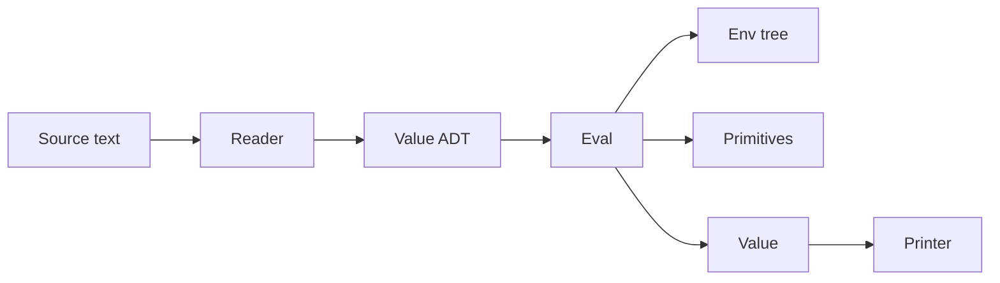

# TREESP OCaml Reference Interpreter

## Decisions (locked)

| Topic | Choice |
|-------|--------|
| Host language | **OCaml** (dune, alcotest) |
| Scoping | Lexical (per roadmap recommendation) |
| Extra `argN` on user calls | Error |
| Macro hygiene | Non-hygienic (expand in caller env per [TREESP.md §8.2](docs/TREESP.md)) |
| Rest parameters | Deferred |
| Errors | Host exceptions with string messages |
| Editor (Phase 9) | **Skipped** — adamo's homework stays in [INTRODUCTION.md](docs/INTRODUCTION.md) |

---

## Project layout

```
treesp/
  dune-project
  dune
  docs/
    IMPLEMENTATION.md      # Phase 0 — v0.2 decisions
    TREESP.md
    INTRODUCTION.md
  lib/
    dune
    value.ml / value.mli   # atoms, trees, void, symbol interning
    printer.ml             # display
    reader.ml              # §4 reader
    env.ml                 # env-as-tree, lexical lookup/extend
    eval.ml                # eval/apply, special forms, primitives
    quasiquote.ml          # quasiquote expansion
    stdlib.ml              # merge-branches, depth, size, clone, error
    treesp.ml              # public API re-exports
  bin/
    dune
    main.ml                # REPL + `treesp test` runner
  test/
    dune
    value_test.ml
    reader_test.ml
    eval_test.ml
    conformance_test.ml    # §10 examples + §4.3 reader errors
  examples/                # .treesp files from spec §10
  README.md                # build/run instructions (Phase 7)
```



---

## Phase 0 — [docs/IMPLEMENTATION.md](docs/IMPLEMENTATION.md)

Short addendum recording the locked decisions above, OCaml/dune as the reference host, and explicit note that the editor is deferred.

---

## Phase 1 — Value model + printer

**[`lib/value.ml`](lib/value.ml)**

```ocaml
type value =
  | Void
  | Bool of bool
  | Num of float
  | Str of string
  | Sym of string          (* intern via Hashtbl *)
  | Tree of { tag : value; branches : (string * value) list }
```

- `()` → `Void`; `(tag)` with zero branches → `Tree { tag; branches = [] }`
- Branches as **ordered association list** (insertion order preserved; lookup by label)
- `equal : value -> value -> bool` for structural equality
- `is_atom`, `is_tree`, predicate helpers

**[`lib/printer.ml`](lib/printer.ml)** — `string_of_value : value -> string`
- Always print desugared `argN` form (allowed per §7.8)
- Void prints as `()`

**Tests:** [`test/value_test.ml`](test/value_test.ml) — void vs empty tree, `equal`

---

## Phase 2 — Reader

**[`lib/reader.ml`](lib/reader.ml)** — `read : string -> value` (and `read_all` for programs)

1. Lex/tokenize: numbers, symbols, strings, `#t`/`#f`, `;` comments
2. S-expression parse with `()` → void
3. Abbreviation expansion: `'`, `` ` ``, `,`, `,@` → quote/quasiquote/unquote forms
4. Positional desugaring: bare subtrees → `arg0`, `arg1`, …
5. Errors per §4.3: unclosed `(`, mixed branches, duplicate labels

**Tests:** [`test/reader_test.ml`](test/reader_test.ml) — Appendix A table:

| Input | Expected |
|-------|----------|
| `()` | void |
| `(f a b)` | `f` / `arg0→a`, `arg1→b` |
| `(f (x a))` | explicit `x` branch only |
| `'x` | `(quote (arg0 x))` |

Plus all §4.3 error cases.

---

## Phase 3 — Evaluator + REPL skeleton

**[`lib/env.ml`](lib/env.ml)** — environment as tree with `parent` branch; lexical `lookup`, `extend`, `define`, `set!` mutation walking parent chain.

**[`lib/eval.ml`](lib/eval.ml)**

Special forms (unevaluated branches unless noted):
- `quote`, `if`, `lambda`, `define`, `begin`, `and`, `or`

Primitives:
- Predicates: `atom?`, `tree?`, `void?`, `number?`, `symbol?`, `string?`, `boolean?`, `eq?`, `equal?`
- Arithmetic: `+`, `-`, `*`, `/`, `=`, `<`, `>`, `<=`, `>=`, `not`
- I/O: `display`, `newline`

**[`bin/main.ml`](bin/main.ml)** — minimal REPL loop reading lines, eval, print result.

**Milestone:** `(+ 1 2)` → `3`; factorial §10.2 → `120`.

---

## Phase 4 — Tree primitives + traversal

Add to [`lib/eval.ml`](lib/eval.ml) (or split `primitives.ml` if it grows):

- Accessors: `tag`, `branch`, `branches`, `branch-labels`, `branch?`
- Construction: `node`, `graft`, `prune`, `tag-set`
- Navigation: `path`
- Traversal: `fold-tree`, `walk-tree`, `map-branches`, `filter-branches`

**Milestone:** §10.3 AST navigation, §10.7 graft/prune.

---

## Phase 5 — Remaining special forms + macros

Special forms: `let`, `cond`, `set!`, `match` (pattern grammar per §7.6)

Macros:
- `define-macro` special form
- Built-in `quasiquote` walker in [`lib/quasiquote.ml`](lib/quasiquote.ml) (§8.5)
- `,@` splicing = branch grafting with duplicate-label error

**Milestone:** §10.5 quasiquote, `when`/`defun` from §8.3–8.4.

**Note on `match`:** implement clause iteration over `arg0`…`argN` branches; patterns support `(?? var)`, positional/labeled tree patterns, optional `(guard g)`.

**Note on rest in macros:** `define-macro (when test . body)` — collect remaining `argN` branches as body list for `begin` expansion (manual rest handling without general rest params).

---

## Phase 6 — Conformance suite

**[`test/conformance_test.ml`](test/conformance_test.ml)** — one test per §10 example:

| Section | Validates |
|---------|-----------|
| §10.1 | Arithmetic |
| §10.2 | Closures, recursion |
| §10.3 | Tree accessors |
| §10.4 | `fold-tree` |
| §10.5 | Quasiquote |
| §10.6 | `match` |
| §10.7 | graft/prune |
| §10.8 | Linked-tree sequence idiom |

**[`examples/*.treesp`](examples/)** — source files for each example.

**[`bin/main.ml`](bin/main.ml)** — `treesp test` subcommand: run all `examples/*.treesp`, compare captured stdout.

---

## Phase 7 — Polish + v0.2 release

- `read` primitive wired to stdin in REPL
- Basic source position on reader errors (line/col in message)
- Update [README.md](README.md):

```bash
opam install . --deps-only   # or dune pkg deps
dune build
dune exec treesp             # REPL
dune test
dune exec treesp -- test     # examples runner
```

- Git tag `v0.2` (only if you ask to commit/tag — will not commit unless requested per your rules)

---

## Phase 8 — Standard library

**[`lib/stdlib.ml`](lib/stdlib.ml)** — register as primitives or prelude bindings:

| Function | Behavior |
|----------|----------|
| `merge-branches` | Union branch maps; error on label conflict |
| `rename-branch` | Copy tree, one label renamed |
| `depth` | Max depth to leaves |
| `size` | Node count |
| `clone` | Deep copy |
| `error` | Print message and abort (§10.6 uses this) |

Tests in conformance suite or dedicated `stdlib_test.ml`.

---

## Phase 9 — Editor

**Cancelled** per your instruction. No tree-buffer UI, no TUI. The counter-challenge in [docs/INTRODUCTION.md](docs/INTRODUCTION.md) remains documentation-only.

---

## Build tooling

**`dune-project`**
```
(lang dune 3.0)
(name treesp)
(generate_opam_files true)
(package (name treesp) (depends ocaml dune alcotest (alcotest :with-test)))
```

Use **alcotest** for all test files. Run `dune test` after each phase.

---

## Implementation order (single pass)

Phases 0→8 in sequence; each phase ends with passing tests before moving on. Estimated ~15–20 OCaml modules/files total.

No commits or git tags unless you explicitly request them at the end.
