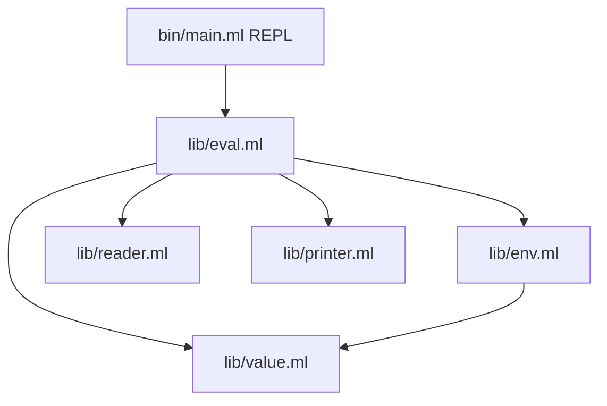

# Phase 3 — Evaluator + REPL

## Current state

Stages 0–2 are committed ([bc062d2](.)): [lib/value.ml](lib/value.ml), [lib/printer.ml](lib/printer.ml), [lib/reader.ml](lib/reader.ml), tests pass for value + reader.

**Next:** eval loop. **Not in this phase:** `let`, `cond`, `set!`, `match`, macros, tree primitives (`node`, `graft`, …), stdlib, conformance suite.

---

## Architecture



---

## 1. Extend the value type for callables

Add to [lib/value.mli](lib/value.mli) / [lib/value.ml](lib/value.ml):

```ocaml
type callable =
  | Prim of string
  | Closure of { env : Env.t; params : value; body : value }

and value = ... | Callable of callable
```

- `Prim` — host-implemented builtin (name dispatches in `eval.ml`)
- `Closure` — captures lexical `Env.t` at definition time
- Update `is_atom` → false for `Callable`; `printer.ml` prints `#<callable>`
- `equal` — primitives equal by name; closures equal only if same params+body (structural, env ignored)

`Macro` variant deferred to Phase 5.

---

## 2. Environment — [lib/env.ml](lib/env.ml)

Per [docs/IMPLEMENTATION.md](docs/IMPLEMENTATION.md) and spec §5.4:

```ocaml
type t = value ref   (* tree tagged env, branches = bindings, parent branch *)
```

| Function | Behavior |
|----------|----------|
| `empty ()` | Fresh root frame |
| `lookup env sym` | Walk current frame, then `parent` chain |
| `extend parent bindings` | New frame with `parent` link + binding branches |
| `define env sym val` | Mutate current frame (add/replace branch) |
| `set env sym val` | Find binding in chain, mutate that frame (needed later; stub ok) |

Use `make_tree (sym "env")` with `("parent", parent_env)` as a reserved branch label.

---

## 3. Evaluator — [lib/eval.ml](lib/eval.ml)

### Runtime record

```ocaml
type runtime = { mutable env : Env.t; mutable input : in_channel }
```

Public API: `make_runtime ()`, `eval : runtime -> value -> value`, `load_string : runtime -> string -> value`.

### Eval loop (spec §5.2)

1. Atoms/void → self-eval; symbol → `Env.lookup`
2. Tree with special-form tag → handler (unevaluated branches)
3. Else evaluate tag → callable; evaluate arg branches; `apply`

### Special forms (Phase 3 only)

| Form | Notes |
|------|-------|
| `quote` | Return `arg0` unevaluated |
| `if` | Positional or explicit `test`/`then`/`else` branches |
| `lambda` | Build `Closure`; see param extraction below |
| `define` | Variable `(define x v)` or function `(define (f x y) body)` |
| `begin` | Evaluate `arg0`…`argN`, return last |
| `and` / `or` | Short-circuit per §6.8 |

### Param extraction (lambda + define)

Sugar `(n)` → tree tagged `n`, zero branches → param `["n"]`.

Sugar `(x y)` → tree tagged `x`, `arg0` → `y` → params `["x"; "y"]` (tag + each positional branch value if symbol).

Explicit `(params (x) (y))` → branch labels `["x"; "y"]`.

Shared helper: `param_labels : value -> string list`.

### Apply

- **Primitive:** dispatch by name on evaluated branch map
- **Closure:** `Env.extend` closure env with arg bindings; eval body; error on missing/extra params (per IMPLEMENTATION.md)

### Primitives (Phase 3)

| Group | Names |
|-------|-------|
| Predicates | `atom?`, `tree?`, `void?`, `number?`, `symbol?`, `string?`, `boolean?`, `eq?`, `equal?` |
| Arithmetic | `+`, `-`, `*`, `/`, `=`, `<`, `>`, `<=`, `>=`, `not` |
| I/O | `display`, `newline` |

Variadic ops collect `arg0`, `arg1`, … via existing `collect_arg_branches`. `eq?` uses physical equality for `Sym`/`Void`; `equal?` uses structural `Value.equal`.

`install_primitives` registers all builtins into the root env at `make_runtime ()`.

---

## 4. REPL — [bin/main.ml](bin/main.ml) + [bin/dune](bin/dune)

```
treesp> (+ 1 2)
3.0
```

- Read line → `Reader.read_all` → eval each form → print unless result is `Void`
- Catch `Treesp_error` / `Read_error`, print message, continue
- Prompt: `treesp> `

---

## 5. Tests — [test/eval_test.ml](test/eval_test.ml)

Update [test/dune](test/dune) to include `eval_test`.

| Test | Source |
|------|--------|
| `(+ 1 2)` → `3` | §10.1 |
| `(+ 1 (* 2 3))` → `7` | §10.1 |
| `(- 10 3 2)` → `5` | §10.1 |
| Factorial `(fact 5)` → `120` | §10.2 |
| `quote` / `if` / `and` short-circuit smoke tests | §6 |

Use `Eval.load_string` with a fresh runtime per test.

---

## 6. Module wiring

- [lib/dune](lib/dune) — add `env.ml`, `eval.ml` (order: env before value callable refs, or use `Env.t = value ref` in env.ml without circular .mli)
- [lib/treesp.ml](lib/treesp.ml) — export `Env`, `Eval`
- Resolve `Env.t` / `Closure` circularity: define `type env = value ref` in `env.mli` (no dependency on callable), keep `Closure` in `value.ml` holding `env`

---

## 7. Milestone check

```bash
dune build
dune test
dune exec treesp   # manual: (define fact ...) then (fact 5)
```

---

## Explicitly deferred to Phase 4+

- Tree primitives: `tag`, `branch`, `node`, `graft`, `path`, `fold-tree`, …
- `let`, `cond`, `set!`, `match`
- `define-macro`, `quasiquote`
- `read` primitive, `examples/`, conformance runner
- README build instructions (Phase 7)

No commit unless you ask.
