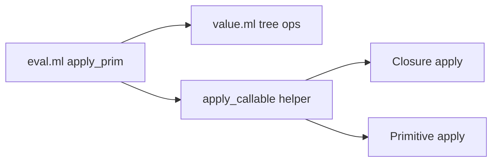

# Phase 4 — Tree Primitives + Traversal

## Current state

Phase 3 is committed ([ac49e91](.)): evaluator, env, REPL, arithmetic + basic predicates.

**Already implemented in [lib/value.ml](lib/value.ml):** `make_tree`, `graft`, `prune`, `tag_set`, `branch_get`, `branch_has`, `tree_tag`, `tree_branches` (immutable copy semantics).

**Not yet wired in [lib/eval.ml](lib/eval.ml):** tree accessors, `node`, `path`, and traversal primitives that call user functions.



---

## Scope (per roadmap)

| Category | Primitives |
|----------|------------|
| Predicates | `branch?` |
| Accessors | `tag`, `branch`, `branches`, `branch-labels` |
| Construction | `node`, `graft`, `prune`, `tag-set` |
| Navigation | `path` |
| Traversal | `fold-tree`, `walk-tree`, `map-branches`, `filter-branches` |

**In scope:** register primitives, callable callbacks, tests for §10.3 + §10.7, basic `fold-tree` / `map-branches` smoke tests.

**Out of scope (Phase 5+):** `let`, `cond`, `set!`, `match`, macros/quasiquote, conformance suite (Phase 6), stdlib (Phase 8).

---

## 1. Callable application helper

Traversal primitives invoke user functions. Add a shared helper in [lib/eval.ml](lib/eval.ml):

```ocaml
let apply_callable rt callable args =
  match callable with
  | Callable (Prim name) -> apply_prim name (List.mapi (fun i v -> (arg_label i, v)) args)
  | Callable (Closure { env; params; body }) ->
      apply_closure rt env params body (List.mapi (fun i v -> (arg_label i, v)) args)
  | _ -> raise (Treesp_error "not callable")
```

This unblocks `fold-tree`, `walk-tree`, `map-branches`, and `filter-branches`.

---

## 2. Simple primitives (extend `apply_prim`)

Add cases to `apply_prim` and register names in `primitive_names`.

| Primitive | Implementation |
|-----------|----------------|
| `branch?` | `(branch? tree label)` — `Bool (branch_has tree (sym_name label))` |
| `tag` | `tree_tag` on single arg; error if not tree |
| `branch` | `branch_get tree (sym_name label)` — returns **void** when absent (§7.2) |
| `branches` | `make_tree (sym "branches") (tree_branches tree)` |
| `branch-labels` | `make_tree (sym "labels")` with `arg0…argN` → label symbols |
| `graft` / `prune` / `tag-set` | delegate to [lib/value.ml](lib/value.ml) |
| `path` | first arg = tree; rest = label symbols; fold `branch_get`; void on any miss |
| `node` | see below |

### `node` semantics (spec gap to document)

Surface form `(node expr (op +) (left 1))` has bare atom `expr`, so the **reader** desugars the call positionally (§4.2). The `node` primitive must reconstruct explicit labels from its arguments:

1. **Tag** = `arg0` (must be a symbol).
2. **Each subsequent `argN`** = a unary-shaped tree `(label value)` desugared as `Tree { tag = Sym label; branches = [("arg0", value)] }` → branch `(label, value)`.
3. If explicit branch labels appear in the evaluated branch map (non-`argN` keys), include them directly.
4. Duplicate labels → error.

Document this in [docs/IMPLEMENTATION.md](docs/IMPLEMENTATION.md) (and a short note in [docs/TREESP.md](docs/TREESP.md) §7.3 if needed) so it matches §2.2.1 / §10.3 examples.

---

## 3. Traversal primitives

Implement as `let rec` helpers in [lib/eval.ml](lib/eval.ml) (split to `lib/tree_prims.ml` only if `eval.ml` grows unwieldy).

### `fold-tree` (§7.4)

```
fold-tree(v, leaf-fn, node-fn):
  if v is atom, void, or callable:
    apply leaf-fn [v]
  else Tree { tag; branches }:
    folded = [(l, fold-tree(child, ...)) for each (l, child)]
    folded-map = make_tree (sym "branches") folded
    apply node-fn [tag; folded-map]
```

Matches §10.4 usage where `node-fn` reads `(branch bs arg0)` etc. on the folded map tree.

### `map-branches`

Recursive map over branch **values**; labels unchanged. Apply `fn` to each child value (not to the root tag). Return new tree with same tag.

### `filter-branches`

For each `(label, value)`, call `pred` with `arg0 = Sym label`, `arg1 = value`; keep branch if result is truthy.

### `walk-tree`

Spec is minimal; implement standard pre/post traversal:

- Atoms/void: `pre-fn(v)` then `post-fn(v)`; return void.
- Trees: `pre-fn(node)` → walk each child → `post-fn(node)`; return void.

Document traversal order in [docs/IMPLEMENTATION.md](docs/IMPLEMENTATION.md).

---

## 4. Tests

Extend [test/eval_test.ml](test/eval_test.ml) (or add `test/tree_test.ml` + update [test/dune](test/dune)):

| Test group | Validates |
|------------|-----------|
| **§10.3 navigation** | Build AST via `node`; `tag`, `branch`, `path` return expected symbols/numbers |
| **§10.7 graft/prune** | `(graft t c 3)` adds branch; `(prune (graft t a 99) b)` => `(node root (a 99))` |
| **Accessors** | `branches`, `branch-labels`, `branch?` |
| **Traversal smoke** | `map-branches` doubles numeric leaves; `fold-tree` sums numeric leaves on small tree |

Use `Treesp.Value.equal` + existing `check_num` helpers. Reuse reader to parse multi-line defines where helpful.

**Gate:** `dune runtest` — all existing + new tests green.

---

## 5. Files touched

| File | Change |
|------|--------|
| [lib/eval.ml](lib/eval.ml) | `apply_callable`, tree + traversal primitives, `primitive_names` |
| [docs/IMPLEMENTATION.md](docs/IMPLEMENTATION.md) | `node` reconstruction rule; `walk-tree` order |
| [docs/TREESP.md](docs/TREESP.md) | Optional one-paragraph `node` + positional-call clarification in §7.3 |
| [test/eval_test.ml](test/eval_test.ml) | §10.3, §10.7, traversal smoke tests |

No changes needed to [lib/value.ml](lib/value.ml) unless tests reveal a gap (e.g. `branch-labels` helper could live there for clarity).

---

## Verification

```bash
dune runtest
dune exec treesp   # manual: (node root (a 1)) etc.
```

After implementation, stop before Phase 5 unless you ask to continue.
