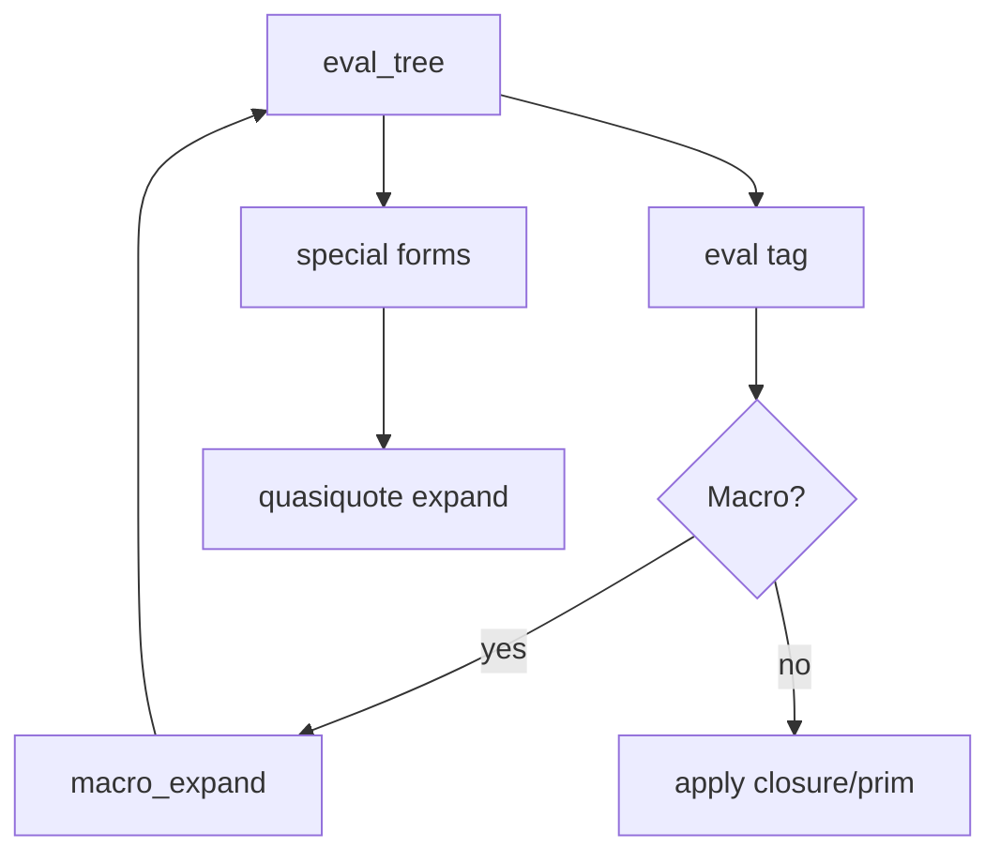

# Phase 5 — Special Forms + Macros + Quasiquote

## Current state

Phase 4 committed ([0487c91](.)): tree primitives, traversal, `node` special form, `eval-data` for literals.

**Already in place:**
- [lib/env.ml](lib/env.ml) — `Env.set` for mutation (used by `set!`)
- [lib/reader.ml](lib/reader.ml) — `` ` ``, `,`, `,@` abbreviations expand to `quasiquote` / `unquote` / `unquote-splicing` trees
- [lib/eval.ml](lib/eval.ml) — `eval_tree` has no macro path; `Callable` is only `Prim | Closure`

**Not started:** `let`, `cond`, `set!`, `match`, `define-macro`, `Macro` type, [lib/quasiquote.ml](lib/quasiquote.ml), prelude macros `when`/`defun`.



---

## Scope

| In scope | Out of scope (later phases) |
|----------|----------------------------|
| `let`, `cond`, `set!`, `match` | Conformance suite runner (Phase 6) |
| `define-macro`, `Macro` callable | `read` primitive (Phase 7) |
| `lib/quasiquote.ml` + `quasiquote` special form | Full stdlib `error`, `merge-branches`, … (Phase 8) |
| `,@` splicing with duplicate-label error | |
| Prelude macros `when`, `defun` | |
| Tests for §10.5, §10.6 (subset), `when` | |

---

## 1. `Macro` callable variant

Extend [lib/value.ml](lib/value.ml) / [lib/value.mli](lib/value.mli):

```ocaml
type callable =
  | Prim of string
  | Closure of { env : value ref; params : value; body : value }
  | Macro of { env : value ref; params : value; body : value }
```

- `is_callable`, `callable_equal` (compare params+body like closures), printer → `#<macro>`
- `is_macro` helper for eval

---

## 2. Macro expansion in [lib/eval.ml](lib/eval.ml)

After special-form check, **before** evaluating call branches:

```ocaml
let op = eval_expr rt tag in
match op with
| Callable (Macro { env; params; body }) ->
    let expanded = macro_expand rt env params body branches in
    eval_expr rt expanded
| ...
```

**`macro_expand`** (per [IMPLEMENTATION.md](docs/IMPLEMENTATION.md) non-hygienic §8.2):
1. Bind macro parameters to **unevaluated** branch subtrees (not `eval_expr` on args).
2. Evaluate `body` in `extend macro_env bindings` (reuse `apply_closure` pattern with unevaluated arg values, or dedicated `apply_macro`).
3. Result tree is `eval_expr`’d in the **caller** environment (`rt.env` unchanged during expand).

**Rest parameters (ad hoc, per v0.2 decision):** Param subtree `(rest name)` — a unary tree tagged `rest` with `arg0` = symbol — binds all call branches from the next positional index onward into a synthetic tree tagged `begin` with `arg0…argN` branches. Enables `when` and `defun` without dotted pairs.

---

## 3. `define-macro` special form

Add to `special_forms` alongside `define`:

```treesp
(define-macro (name params) body)
(define-macro (params (name) (params) (rest body)) body)   ; with rest
```

Mirror [eval_define](lib/eval.ml): positional `(name params) body` or function-shaped first branch; store `Callable (Macro { env = rt.env; params; body })`.

`define-macro` itself is a **special form** (not user-definable via macro).

---

## 4. Quasiquote — [lib/quasiquote.ml](lib/quasiquote.ml)

New module with `expand : runtime -> value -> value` walking a template:

| Template node | Action |
|---------------|--------|
| atom / void | return as-is |
| `(unquote e)` | `eval_expr rt e` |
| `(unquote-splicing e)` | `eval_expr rt e` must be tree; return branches for grafting |
| other tree | recurse children; splice grafts branches into parent; **error on duplicate labels** |

Wire as **special form** `quasiquote` → `Quasiquote.expand rt template` (spec §6.11 allows macro or special form; special form avoids bootstrap circularity).

`unquote` / `unquote-splicing` outside `quasiquote` expansion → error (or only valid as special forms that error unless expanded — expansion handles them).

Register in [lib/treesp.ml](lib/treesp.ml) and [lib/dune](lib/dune).

---

## 5. Remaining special forms in [lib/eval.ml](lib/eval.ml)

### `set!` (§6.6)
- `arg0` name: `eval_data` (literal symbol)
- `arg1` value: `eval_expr`
- `Env.set rt.env name value`; return `Void`

### `let` (§6.9)
- Positional: `(let ((x 1) (y 2)) body)` → `arg0` = bindings tree, `arg1` = body
- Parse bindings tree: each positional child is unary `Tree { tag = Sym name; branches = [("arg0", init)] }`
- Evaluate each `init` in **outer** env; extend; eval body

### `cond` (§6.10)
- Clauses = `arg0…argN`, each a unary or two-branch tree
- Positional clause `(test expr)` → tag = test sym, `arg0` = expr
- `else` as test symbol is always truthy
- First truthy test → eval and return its expr

### `match` (§7.6) — special form, not primitive
- `arg0` = scrutinee (`eval_expr`); `arg1…` = clauses
- **Clause shapes:**
  - 2-branch positional: pattern + result
  - 3-branch positional: pattern + guard + result (matches §10.6 `((?? n) (number? n) n)`)
- **Patterns** (unevaluated):
  - atom → `equal?` match
  - `(?? var)` → bind any value
  - `(tag p1 p2 …)` → positional branch patterns on tree
  - `(tag (l1 p1) …)` → explicit labeled patterns
- On match: extend env with bindings; if guard present, eval guard (must be truthy); eval result in extended env
- No match → error

Add minimal **`error` primitive** (display message + `Treesp_error`) so §10.6 `eval-expr` fallback clause can be tested without waiting for Phase 8 stdlib.

---

## 6. Prelude macros `when` and `defun`

After `define-macro` + quasiquote work, load at `make_runtime` via `load_string` (or inline OCaml):

```treesp
(define-macro (params (when _) (test) (rest body))
  (quasiquote (if (unquote (arg0 test)) (begin ,@body))))

(define-macro (params (defun _) (name) (params) (rest body))
  (quasiquote (define (unquote (arg0 name)) (unquote (arg0 params))
                (begin ,@body))))
```

Exact quasiquote surface may need adjustment once expand is tested; goal is §8.3–8.4 behavior.

---

## 7. Tests — [test/eval_test.ml](test/eval_test.ml)

| Group | Validates |
|-------|-----------|
| `let` | `(let ((x 10)) (+ x 1))` → 11 |
| `set!` | mutate binding, returns void |
| `cond` | first matching clause; `else` fallback |
| `quasiquote` | §10.5 `(define x 10)` + backtick `node` form → `(node expr (op +) (left 1) (right 10))` |
| `,@` splice | §4.4 example (graft branches, duplicate-label error case) |
| `when` | expands to `if` + `begin` |
| `match` | §10.6 `eval-expr` on `(+ 1 2)` and numeric literal (2–3 clauses; full 4-clause with `error`) |

**Gate:** `dune runtest` — all existing + new tests green.

---

## 8. Documentation

Update [docs/IMPLEMENTATION.md](docs/IMPLEMENTATION.md):
- `Macro` representation and expansion order
- Rest param convention `(rest name)`
- `match` clause arity (2 vs 3) and guard semantics
- `quasiquote` as special form + splicing rules

Optional short notes in [docs/TREESP.md](docs/TREESP.md) §6.9–6.11 / §8 if ambiguities surface during implementation.

---

## Files touched

| File | Change |
|------|--------|
| [lib/value.ml](lib/value.ml) / [.mli](lib/value.mli) | `Macro` variant, helpers |
| [lib/printer.ml](lib/printer.ml) | print `#<macro>` |
| [lib/quasiquote.ml](lib/quasiquote.ml) / [.mli](lib/quasiquote.mli) | template expand + splice |
| [lib/eval.ml](lib/eval.ml) | special forms, macro path, `error` prim, prelude load |
| [lib/treesp.ml](lib/treesp.ml), [lib/dune](lib/dune) | wire quasiquote |
| [test/eval_test.ml](test/eval_test.ml) | Phase 5 tests |
| [docs/IMPLEMENTATION.md](docs/IMPLEMENTATION.md) | macro/match/quasiquote notes |

---

## Verification

```bash
dune runtest
dune exec treesp   # manual: (when #t (display 1))
```

Stop before Phase 6 unless you ask to continue.
