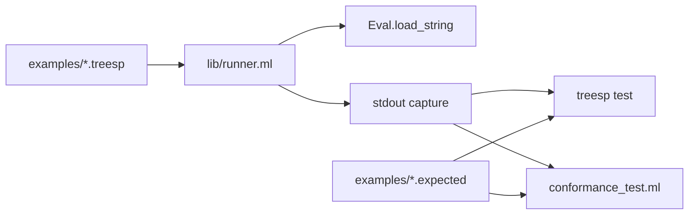

# Phase 6 — Conformance Suite Runner

## Current state

Phase 5 committed ([52b0b67](.)): special forms, macros, quasiquote, prelude `when`/`defun`.

**Already validated in [test/eval_test.ml](test/eval_test.ml):** §10.1 (partial), §10.2 factorial, §10.3 navigation, §10.5 quasiquote, §10.7 graft/prune, partial §10.6 match.

**Missing per [treesp_ocaml_interpreter plan](file:///Users/ricudis/.cursor/plans/treesp_ocaml_interpreter_2ddd23f5.plan.md):**
- [examples/](examples/) directory (not created)
- [test/conformance_test.ml](test/conformance_test.ml)
- `treesp test` subcommand in [bin/main.ml](bin/main.ml)
- §10.4 `fold-tree` / `tree-sum`, full §10.6 `eval-expr`, §10.8 linked-tree idiom
- **`apply` primitive** (user chose to add in this phase)



---

## Scope

| In scope | Out of scope (later phases) |
|----------|----------------------------|
| `apply` primitive + **normative spec in [TREESP.md](docs/TREESP.md) §7.9** | `read` primitive (Phase 7) |
| `examples/*.treesp` + `.expected` golden stdout | `merge-branches`, `depth`, … (Phase 8) |
| [lib/runner.ml](lib/runner.ml) shared by CLI + tests | README build instructions (Phase 7) |
| [test/conformance_test.ml](test/conformance_test.ml) | v0.2 git tag (Phase 7, on request) |
| `treesp test` in [bin/main.ml](bin/main.ml) | Editor (Phase 9) |
| §10.1–§10.8 example programs | Moving all existing unit tests into files |

---

## 1. `apply` — spec + implementation

### 1a. Normative spec — [docs/TREESP.md](docs/TREESP.md)

§10.4 and §10.8 call `(apply fn args-tree)` but §7 has no primitive entry (only the internal §5.3 `apply` algorithm). Add **§7.9 Application** after §7.8:

| Primitive | Signature | Description |
|-----------|-----------|-------------|
| `apply` | `(apply operator args-tree)` | Invoke `operator` with the branches of `args-tree` as call arguments |

**Semantics** (align with §5.3):

- `arg0` (`operator`): evaluated; must be a primitive or closure.
- `arg1` (`args-tree`): evaluated; must be a **tree**. Its branches (in insertion order, typically `arg0`…`argN`) form the argument branch map passed to `apply` from §5.3.
- Variadic primitives (`+`, `*`, etc.) collect all positional branches from `args-tree` in order (same rule as §7.7).
- Closures receive bindings per their `params` tree, as with a normal call.
- Errors: `apply: not callable`, `apply: args must be a tree`, arity errors from the callee.

**Cross-references to update:**

- §9.1 `treesp.core` — add `apply` to the bullet list.
- §10.4 footnote (“`apply` on `+` with multiple numeric branches…”) — point to §7.9 instead of being the only definition.

No change to §5.3 pseudocode (that remains the general apply algorithm); §7.9 documents the **surface primitive** that exposes it.

### 1b. Implementation — [lib/eval.ml](lib/eval.ml)

Add `apply` to `primitive_names` and `apply_prim`:

```treesp
(apply operator args-tree)
```

- `arg0` = operator (evaluated); `arg1` = args tree (evaluated)
- `collect_arg_branches` on `args-tree`, then `apply_callable` / `apply_prim`
- Match §7.9 error cases

Enables `(apply + (map-branches t tree-sum))` and `(apply seq (prune branches arg0))`.

---

## 2. Shared runner — [lib/runner.ml](lib/runner.ml) / [.mli](lib/runner.mli)

Extract REPL-style execution into a reusable module:

```ocaml
val run_program : ?rt:Eval.runtime -> string -> (value list * string)
(* fresh runtime unless rt given; returns (non-void results, captured stdout) *)

val run_file : string -> (value list * string)

val examples_dir : unit -> string   (* workspace examples/ via dune env or fallback *)
```

Implementation:
- Fresh `make_runtime` per file (isolated defines)
- Redirect `Printer.display` / `newline` output to a `Buffer.t` during run (or capture `Format` if display uses stdout — check [lib/printer.ml](lib/printer.ml))
- Evaluate forms with `Reader.read_all` + `Eval.eval` (same as [bin/main.ml](bin/main.ml) REPL)
- Collect non-void results; optionally format them like REPL for golden comparison

Wire in [lib/treesp.ml](lib/treesp.ml) and [lib/dune](lib/dune).

---

## 3. Example files — [examples/](examples/)

One pair per §10 section, adapted where the reader rejects spec surface syntax:

| File | Source | Notes |
|------|--------|-------|
| `10-01-arithmetic.treesp` | §10.1 | `(+ 1 (* 2 3))`, `(- 10 3 2)` |
| `10-02-factorial.treesp` | §10.2 | define + `(fact 5)` |
| `10-03-navigation.treesp` | §10.3 | define `t`, then tag/branch/path forms |
| `10-04-tree-sum.treesp` | §10.4 | Full `tree-sum` using `apply` + `map-branches` on §10.3 AST |
| `10-05-quasiquote.treesp` | §10.5 | define `x`, backtick `node` form, print `form` |
| `10-06-eval-expr.treesp` | §10.6 | `eval-expr` with labeled match patterns `(+ (arg0 (?? a)) (arg1 (?? b)))` to avoid reader duplicate-`??` error |
| `10-07-graft-prune.treesp` | §10.7 | graft + prune chain |
| `10-08-sequence.treesp` | §10.8 | `seq` via `(defun seq () …)` rest macro (not dotted `.`); plus explicit 1→2→3 tree |

Each `*.treesp` has a companion `*.expected` file — golden stdout (one line per printed result, trailing newline). Runner compares trimmed stdout.

---

## 4. `treesp test` CLI — [bin/main.ml](bin/main.ml)

Extend argument parsing:

```
treesp              # REPL (unchanged)
treesp repl         # REPL
treesp test         # run all examples/*.treesp, exit 1 on any mismatch
treesp test FILE    # run one example
```

On failure: print file name, expected vs got diff (first differing line). On success: brief summary (`8/8 passed`).

---

## 5. Conformance tests — [test/conformance_test.ml](test/conformance_test.ml)

Alcotest suite `conformance` that:
- Iterates `examples/*.treesp` via `Runner.run_file` + golden compare (same logic as CLI)
- Adds 1–2 programmatic checks not worth file fixtures (e.g. `apply` arity error)

Update [test/dune](test/dune):
- Add `conformance_test` to `(names …)`
- `(env (_ (env-vars (TREESP_ROOT %{workspace_root}))))` so runner finds `examples/`

Keep existing unit tests in `eval_test.ml` / `reader_test.ml` — conformance is integration layer on top, not a replacement.

---

## 6. Documentation

Update [docs/TREESP.md](docs/TREESP.md):
- New §7.9 Application (`apply` primitive table + semantics + errors)
- §9.1 and §10.4 cross-references

Update [docs/IMPLEMENTATION.md](docs/IMPLEMENTATION.md):
- Brief pointer to §7.9 (implementation follows spec verbatim)
- Conformance layout (`examples/`, `.expected`, `treesp test`)
- Note §10.6 pattern adaptation (labeled `arg0`/`arg1` under `+` / `*`)

Defer README changes to Phase 7.

---

## Verification

```bash
dune runtest                    # all suites green (value + reader + eval + conformance)
dune exec treesp -- test          # CLI runner passes
dune exec treesp                  # manual smoke on §10 examples
```

**Gate:** 50 existing tests + ~8 conformance tests pass; `treesp test` reports all examples OK.

Stop before Phase 7 unless you ask to continue.
