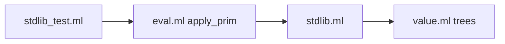

# Phase 8 — Standard Library (v0.3)

## Current state

v0.2 is complete ([8105706](.)): interpreter, conformance suite, `read`, positioned reader errors.

**Already in place:**
- [lib/value.ml](lib/value.ml) — immutable trees, `graft`/`prune`/`tag_set`, `equal`
- [lib/eval.ml](lib/eval.ml) — `apply_prim` + `primitive_names` + `install_primitives`
- `error` primitive — already implemented (§10.6); **not** part of Phase 8 scope

**Missing:** `lib/stdlib.ml` (referenced in [docs/IMPLEMENTATION.md](docs/IMPLEMENTATION.md) layout but not created), five §9.5 functions, v0.3 milestone.



---

## Scope

| In scope | Out of scope |
|----------|----------------|
| `merge-branches`, `rename-branch`, `depth`, `size`, `clone` | Phase 9 editor |
| `test/stdlib_test.ml` + eval wiring | Module system / `import` |
| IMPLEMENTATION.md v0.3 complete | Git tag `v0.3` (only on request) |
| Optional TREESP.md §9.5 note | Fuller §10.4 recursive `tree-sum` example |

---

## 1. Implement `lib/stdlib.ml`

New module with pure tree helpers operating on `Value.value`. Export via `lib/stdlib.mli`.

### `merge-branches`

```
(merge-branches tree tree) -> tree
```

- Both arguments must be trees; tags must be `equal?`
- Returns a new tree with the same tag and the union of both branch lists (order: left tree branches, then right)
- **Conflict policy:** if a label appears in both trees and values are not `equal?`, raise `merge-branches: conflicting label <label>`
- Duplicate label with identical values: keep one copy (no error)

### `rename-branch`

```
(rename-branch tree old-label new-label) -> tree
```

- `old-label` / `new-label` are **literal symbols** (same convention as `graft`/`prune` in [lib/eval.ml](lib/eval.ml))
- Deep-copies the argument tree; renames one branch label at the **root node only**
- Error if `old-label` missing or `new-label` already present
- Child subtrees are cloned recursively; labels inside children are unchanged

### `depth`

```
(depth value) -> number
```

- Non-tree (atom, void, callable): `0`
- Tree: `1 + max(depth child)` over branches; tree with zero branches: `1`

### `size`

```
(size value) -> number
```

- Every value counts as one node: atom → `1`; tree → `1 + sum(size child)`

### `clone`

```
(clone value) -> value
```

- Deep-copies tree structure; atoms returned as-is
- `Callable` values are shared (not duplicated) — trees of data only

---

## 2. Wire primitives in [lib/eval.ml](lib/eval.ml)

Add to `primitive_names` (after tree traversal group, before arithmetic):

```ocaml
"merge-branches"; "rename-branch"; "depth"; "size"; "clone";
```

Add `apply_prim` cases delegating to `Stdlib`:

| Primitive | Arity | Args |
|-----------|-------|------|
| `merge-branches` | 2 | two trees |
| `rename-branch` | 3 | tree, `Sym old`, `Sym new` |
| `depth` | 1 | any value |
| `size` | 1 | any value |
| `clone` | 1 | any value |

Wrong arity / type errors use existing `Treesp_error` style (`wrong arity`, `expected tree`, etc.).

Optional: re-export `Stdlib` from [lib/treesp.ml](lib/treesp.ml) for tests.

---

## 3. Tests — [test/stdlib_test.ml](test/stdlib_test.ml)

Add to [test/dune](test/dune) names list.

| Test | Assertion |
|------|-----------|
| `merge-branches` ok | `(merge-branches (node t (a 1) (b 2)) (node t (c 3)))` → 3 branches |
| `merge-branches` conflict | overlapping label, different values → `Treesp_error` |
| `merge-branches` tag mismatch | different tags → error |
| `rename-branch` | `(rename-branch (node r (x 1) (y 2)) x z)` → `(node r (z 1) (y 2))` |
| `rename-branch` missing | old label absent → error |
| `depth` | atom `0`; `(node a (x 1))` → `2`; nested tree → `3` |
| `size` | atom `1`; small tree counts correctly |
| `clone` | `equal?` to original, `eq?` false for trees (new structure) |

Use `Eval.eval_string` / `fresh` pattern from [test/eval_test.ml](test/eval_test.ml).

---

## 4. Documentation

**[docs/IMPLEMENTATION.md](docs/IMPLEMENTATION.md)**
- New **Standard library (Phase 8)** section documenting the five functions and semantics above
- Mark **v0.3 complete** in milestones table

**[docs/TREESP.md](docs/TREESP.md)** (optional one-liner)
- Note in §9.5 that v0.3 implements these as prelude primitives

---

## 5. Verification

```bash
dune runtest          # existing 61+ tests + ~8 new stdlib tests
dune exec treesp -- test
```

**Gate:** all tests green; no conformance regressions.

Stop after Phase 8 unless you ask to continue (editor, eval-time positions, etc.).
